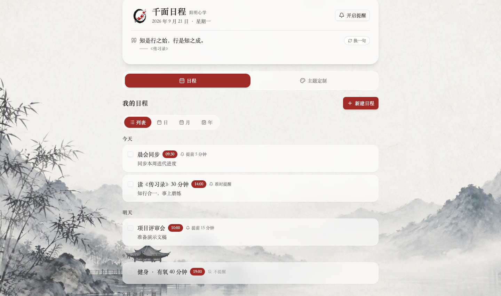
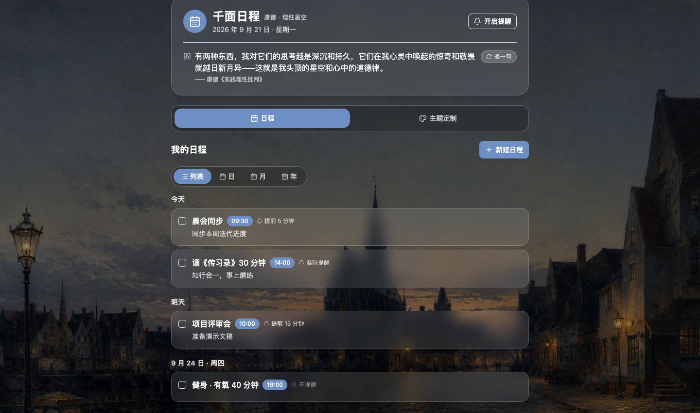
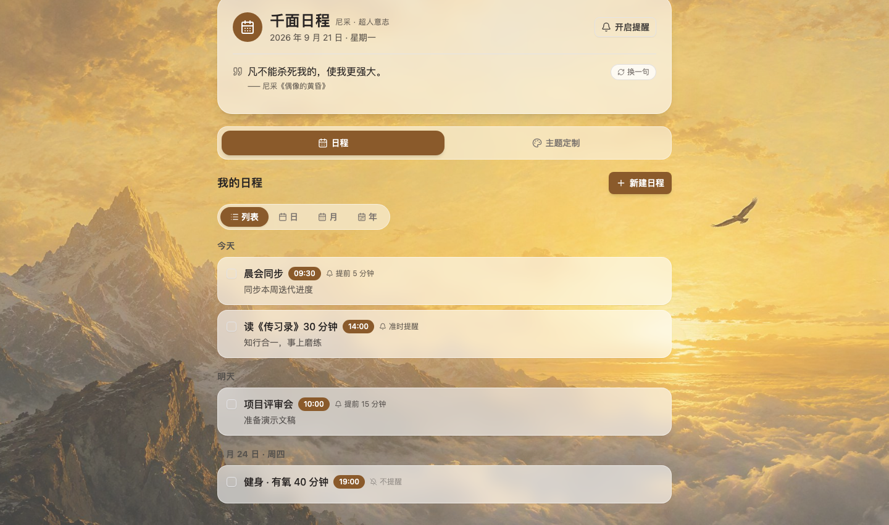
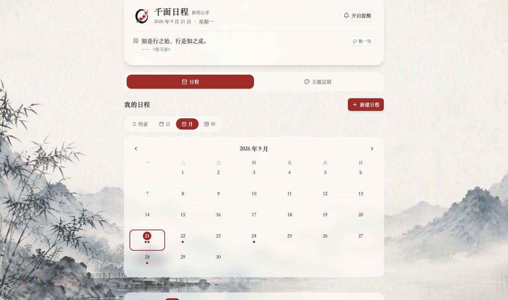
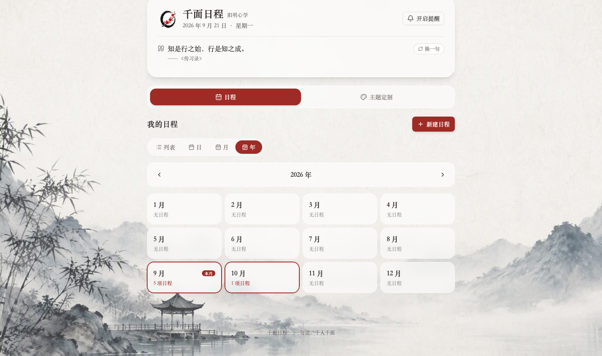
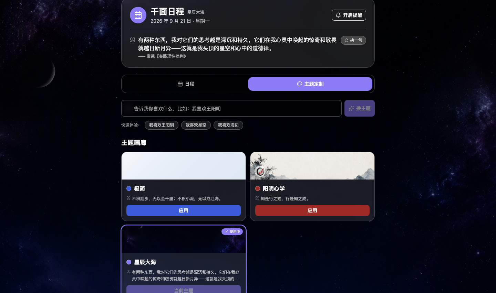
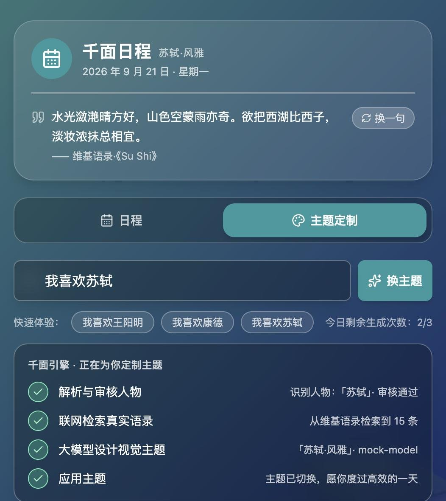

# 群星日程 · QunXing Schedule

> 一句话，千人千面 —— 每位你敬仰的人物，都是一颗星

互联网时代的产品满足绝大部分人的共性需求；AI 时代，应用可以为每一个人生成。**群星日程**是这个理念的最小可行验证（MVP）：日程管理功能所有人共用，而 App 的 Logo、背景、语录、配色，由用户的一句话实时生成——说出你敬仰的那颗「星」，应用就为你点亮它的主题。

用户输入「我喜欢王阳明」，App 自动完成：解析需求 → 检索王阳明语录 → 生成水墨视觉主题 → 一键套用。换成其他人物（如「我喜欢苏轼」）则走在线生成：**审核人物 → 联网检索真实语录 → 大模型设计视觉**。

## 效果预览

| 阳明心学（"我喜欢王阳明"） | 康德 · 理性星空（"我喜欢康德"） | 尼采 · 超人意志（"我喜欢尼采"） |
|---|---|---|
|  |  |  |

| 月视图（日历网格） | 年视图（12 个月总览） | 主题定制页（主题画廊） |
|---|---|---|
|  |  |  |

| AI 在线生成（"我喜欢苏轼"：审核 → 国内互联网语录检索 → 大模型设计视觉） |
|---|
|  |

## 界面结构

应用分为两个顶层 Tab，共享头部（Logo、主题徽标、日期、主题语录 + 「换一句」手动切换）：

- **「日程」Tab**：日程的增删改查 + 四种视图（列表 / 日 / 月 / 年）
- **「主题定制」Tab**：一句话换主题、主题画廊

## 核心功能

### 🎨 主题引擎（人物专属 · 千人千面）
- **一句话换主题**：输入「我喜欢某人物」，命中人物预设走本地数据 + 流水线动效；未命中则走**在线生成流水线**（见下），背景 1s 交叉淡入切换
- **人物预设**：王阳明（水墨 + 印章 Logo + 衬线）、康德（柯尼斯堡黄昏油画）、尼采（金色群山与雄鹰），语录均取自真实著作并核验出处
- **主题即数据**：每个主题是一份 `AppTheme` 配置（背景图 / 渐变、Logo、强调色、文字明暗、字体、语录集），见 `src/themes/index.ts`
- **主题画廊**：3 位人物预设 + 会话中 AI 生成的主题以预览卡展示，一键应用，当前主题有标记（极简为默认主题，不进画廊）
- 支持 `?theme=wangyangming` / `?theme=kant` / `?theme=nietzsche` URL 直达，方便演示分享

#### 在线生成流水线（非预设人物）
输入未命中预设时，依次执行四个真实步骤（非模拟动效）：

1. **解析与审核人物**（LLM Call 1）：仅允许真实人物（历史、哲学、文学、科学、艺术等）；**拒绝**：非人物输入（如"海边"）、娱乐圈明星、政治敏感/争议人物——拒绝时 toast 说明原因
2. **联网检索真实语录**：经服务端代理检索国内互联网（cn.bing.com，「经典语录/名句/名言」三组查询词），从结果页摘要中抽取候选语录（来源标注为网站域名）；**检索不到则拒绝生成**（"为避免编造，已取消生成"），绝不伪造语录
3. **大模型设计视觉主题**（LLM Call 2）：模型只做视觉设计（主题名/强调色/渐变/emoji），并**从检索到的语录编号中挑选 6-8 条**——无权编造语录
4. **应用主题**：AI 主题进入画廊（"AI 生成"徽标 + emoji 水印背景）

- **不限生成次数**：前端没有任何配额限制，可随意生成；服务端保留每 IP 防滥用限流（chat 10 次/天/IP、quotes 30 次/天/IP）——这是保护部署者 API 额度的安全措施而非用户配额，触发时 toast 友好提示「今日生成次数已达上限，明天再来吧」
- 人物主题必须在线审核 + 检索（无本地兜底，以保证安全策略与语录真实性）；服务端未配置 Key 时失败原因会如实提示

### 📅 日程管理（四种视图看全部日程）
- **列表**：按「今天 / 明天 / 未来日期」分组展示全部日程，就近排序
- **日**：选择任意日期，当日时间线列表，前后日切换
- **月**：真实日历网格（周一开头），有日程的日期显示圆点/计数，点击日期看当日明细
- **年**：12 个月份卡片总览，每月日程计数，点击跳转对应月视图
- 新建 / 编辑 / 删除 / 完成日程（标题、日期、时间、备注），localStorage 持久化

### 🔔 日程提醒
- 准时 / 提前 5 分钟 / 提前 15 分钟 / 不提醒
- 到点同时触发浏览器 Notification + 应用内 Toast，防重复触发
- 通知权限优雅降级（非安全上下文自动退回应用内提醒）

## 技术栈

React 19 · TypeScript · Vite 7 · Tailwind CSS 3 · shadcn/ui · lucide-react · sonner · Vercel Serverless Functions / Cloudflare Workers（LLM 代理，二选一）

## 真实架构

密钥不下发浏览器：前端只调用自家服务端代理，真实 API Key 仅存服务端环境变量。代理有两种部署形态（加固逻辑完全一致，二选一）：

```
┌─────────────────────────────── 浏览器（静态 SPA） ───────────────────────────────┐
│  群星日程 SPA                                                                      │
│    画像生成 ──────────────▶ pollinations.ai（免费免 Key 文生图，CORS 直连，零配置）   │
│    LLM 调用 ──POST（占位 bearer，无真实 Key）──┐                                    │
│    语录检索 ──POST /quotes（候选名数组）───────┤                                    │
└──────────────────────────────────────────────┼───────────────────────────────────┘
                                                ▼
        部署方式 A（推荐）                              部署方式 B
┌─ Vercel Serverless（api/，同源）─────────────┐   ┌─ Cloudflare Worker（workers/llm-proxy）─┐
│  · /api/chat（LLM 代理）                      │   │  · /v1/chat/completions（LLM 代理）      │
│  · /api/quotes（语录检索代理）                │   │  · /v1/quotes（语录检索代理）            │
│  · Vercel 部署时同源直连，零配置               │   │  · 前端经 VITE_PROXY_URL 指向 Worker    │
└──────────────────────┬──────────────────────┘   └───────────────────┬──────────────────────┘
                       │  共同防线：Origin 白名单 · 请求体/字段白名单 · 强制模型
                       │  分业务 IP 限流（chat 10 · image 10 · quotes 30 次/天）
                       │  Authorization: Bearer $UPSTREAM_API_KEY（服务端环境变量）
                       ▼
        大模型厂商（DeepSeek / Moonshot / OpenAI 等兼容接口）
        cn.bing.com（语录检索由服务端代理发起——见下方说明）

可选：设置 VITE_IMAGE_BASE_URL 后，画像改走 代理（api/image.ts / Worker
/v1/images/generations）→ Keyed 图像 API（OpenAI images 兼容，密钥在服务端）。
```

**为什么语录检索走服务端**：语录来源为国内互联网检索（cn.bing.com）——必应结果页
无 CORS 头，浏览器无法直连，因此检索统一经 `/quotes` 代理在服务端完成（算法共享
`shared/websearch.ts`：候选名按序尝试 ×「经典语录/名句/名言」查询词、解析结果页摘要、
相关性闸门过滤降级页）。cn.bing.com 国内直连与 Vercel/Cloudflare 边缘节点均可达，
不再依赖被 GFW 封锁的维基语录。本地开发时 `/api` 由 Vite 中间件提供（见「本地运行」）。

安全要点：

- **仓库不含任何密钥**：Vercel 方式在 Dashboard 设 `UPSTREAM_API_KEY` 环境变量；Cloudflare 方式经 `wrangler secret put` 设置；代理地址经仓库 Variable `VITE_PROXY_URL` 注入构建
- **访客零配置、零设置项**：应用没有任何 Key 输入界面，始终使用部署方在服务端配置的接口
- **服务端硬防线**：Origin 校验、请求体/字段白名单、强制模型、IP 限流，全部在服务端强制执行（`api/chat.ts` 与 `workers/llm-proxy/src/index.ts` 逻辑同步维护）

## 应用架构

```
用户输入："我喜欢苏轼"
        │
        ▼
┌──────────────────┐     命中预设（王阳明/康德/尼采）
│  人物关键词匹配    │────────────────────▶ 本地 AppTheme，直接应用
└──────┬───────────┘
       │ 未命中
       ▼
┌──────────────────────────────────────────────┐
│  在线生成流水线                                 │
│  ① 审核人物（LLM）→ ② 互联网语录检索 → ③ 视觉设计（LLM）│
│  → ④ 生成人物画像（文生图，失败自动降级 emoji 标识）  │
│  → ⑤ 应用主题                                  │
│  拒绝/失败即中止                           │
└──────────────────┬───────────────────────────┘
                   ▼
        ┌─────────────────────────────────────┐
        │  App Shell（功能层，所有人共用）         │
        │  useSchedule · useReminders · 组件层    │
        └─────────────────────────────────────┘
```

```
src/
├── themes/index.ts          # 主题引擎：AppTheme 定义 + 3 位人物预设（蚀刻肖像 Logo）+ 默认极简主题
├── services/
│   ├── llmTheme.ts          # LLM 双调用：人物审核 + 视觉设计（含 portraitPrompt；服务端代理优先）
│   ├── imageGen.ts          # 人物画像：pollinations.ai 免费直连（默认）/ 代理 Keyed 图像 API（可选）
│   └── quoteSearch.ts       # 语录检索：服务端代理 /quotes（必应无 CORS 无直连；拒绝编造）
├── hooks/
│   ├── useSchedule.ts       # 日程 CRUD + localStorage 持久化
│   └── useReminders.ts      # 提醒引擎：定时扫描 + Notification + Toast
├── components/
│   ├── ThemePipeline.tsx    # 主题生成流水线（步骤即真实任务，失败即中止）
│   ├── ThemeGallery.tsx     # 主题画廊（预览卡 + 一键应用）
│   ├── ThemeBackground.tsx  # 双层背景交叉淡入 + AI 主题 emoji 水印
│   ├── QuoteCarousel.tsx    # 头部语录 + 「换一句」手动切换
│   ├── EventDialog.tsx      # 新建/编辑日程弹窗
│   ├── EventList.tsx        # 分组日程列表（列表视图）
│   ├── DayView.tsx          # 日视图
│   ├── MonthView.tsx        # 月视图（日历网格）
│   └── YearView.tsx         # 年视图（12 个月总览）
├── sections/
│   ├── ScheduleSection.tsx  # 「日程」Tab：视图切换 + 各视图组装
│   ├── ThemeSection.tsx     # 「主题定制」Tab：输入 + 主题画廊
│   └── HeroSection.tsx      # 一句话输入 + 快速体验口令 + 生成路径调度
└── pages/Home.tsx           # 共享头部 + 双 Tab 组装

api/chat.ts                  # Vercel Serverless 代理（同源 /api，密钥不落浏览器）
api/image.ts                 # Vercel 图像生成代理（可选；默认画像走免费 pollinations.ai）
api/quotes.ts                # Vercel 语录检索代理（服务端访问 cn.bing.com）
api/tsconfig.json            #   独立类型检查配置（npx tsc --noEmit -p api）
shared/websearch.ts          # 语录检索核心算法（Vercel/Worker 两方共用，Edge 兼容纯正则解析）
vite-plugin-dev-api.ts       # 本地开发 /api 中间件（npm run dev 即完整环境，与 Vercel 同一批 handler）
vercel.json                  # Vercel 配置：/api/chat/completions、/api/image/images/generations rewrite

workers/llm-proxy/           # Cloudflare Worker：服务端 LLM 代理（替代方案，密钥不落浏览器）
├── wrangler.toml            #   Worker 配置（vars：上游地址/模型/Origin 白名单）
├── src/index.ts             #   代理逻辑（CORS/限流/字段白名单/强制模型）
└── README.md                #   部署与密钥设置指南

.github/workflows/deploy.yml # GitHub Pages 自动部署（push main → build → deploy）
.env.example                 # 环境变量示例（服务端 UPSTREAM_* / VITE_PROXY_URL / 遗留 BYOK）
scripts/mock-llm.py          # 内容感知的模拟大模型（无 Key 演示完整流程）
```

## 本地运行

```bash
npm install
npm run dev        # 开发服务器（/api 由 Vite 中间件提供，见下）
npm run build      # 生产构建 → dist/
```

**`npm run dev` 即完整环境**：`/api/chat`、`/api/quotes`、`/api/image` 由 Vite 中间件
（`vite-plugin-dev-api.ts`）托管，运行的是与 Vercel 生产**同一批** Edge 处理器
（`api/*.ts`）。把真实 Key 写进 `.env.local` 的 `UPSTREAM_API_KEY`（无 `VITE_` 前缀 →
不进浏览器产物），本地开发即与生产同构、零配置：

```bash
# .env.local（gitignored，不会提交）
UPSTREAM_API_KEY=sk-...                        # DeepSeek / Moonshot / OpenAI 等兼容接口
UPSTREAM_BASE_URL=https://api.deepseek.com/v1  # 可选
UPSTREAM_MODEL=deepseek-chat                   # 可选
```

演示用 URL 参数（可组合）：`?theme=wangyangming` 直达主题、`?tab=theme` 直达主题定制页、`?view=month` 直达月视图、`?demo=1` 在无数据时注入示例日程。

### 服务端配置（在线生成必需）

**应用没有任何设置界面——始终使用部署方在服务端配置的接口**，访客零配置、零设置项。非预设人物主题必须经由大模型（在线审核 + 真实语录检索，无本地兜底）。接口解析顺序：**显式代理（`VITE_PROXY_URL`）> `VITE_LLM_*` 环境变量（休眠回退）> 内置同源 `/api`**：

- **服务端代理（推荐）**：真实密钥只在服务端。Vercel 部署时在 Dashboard 配置 `UPSTREAM_API_KEY` 即可（前端默认同源 `/api`，见 `api/chat.ts`；本地开发由 Vite 中间件提供同一批 handler，见「本地运行」）；GitHub Pages 部署则构建时注入 `VITE_PROXY_URL` 指向 Cloudflare Worker（见「真实架构」）
- **`VITE_LLM_*` 环境变量（休眠回退，不推荐）**：仅供高级自托管者在无服务端的环境中使用——**Key 会打包进浏览器产物**，请优先使用服务端变量 `UPSTREAM_API_KEY`

```bash
# 服务端变量（Vercel Dashboard 或本地 .env.local，均不进浏览器产物）
UPSTREAM_API_KEY=sk-...                        # DeepSeek / Moonshot / OpenAI 等兼容接口
UPSTREAM_BASE_URL=https://api.deepseek.com/v1  # 可选
UPSTREAM_MODEL=deepseek-chat                   # 可选

# 前端变量
VITE_PROXY_URL=https://qunxing-llm-proxy.<your-subdomain>.workers.dev  # GitHub Pages 部署用
```

LLM 请求超时 45 秒，语录检索超时 15 秒；失败即中止并提示原因。服务端保留每 IP 防滥用限流（chat 10 次/天/IP、quotes 30 次/天/IP，保护部署者的 API 额度），触发 429 时映射为「今日生成次数已达上限，明天再来吧」。

**没有 API Key 也想体验完整流程？** 项目自带内容感知的模拟大模型服务：

```bash
python3 scripts/mock-llm.py   # 监听 127.0.0.1:8787
# 然后在 .env.local 中指向 mock（休眠回退路径，仅本地调试用）：
# VITE_LLM_BASE_URL=http://127.0.0.1:8787/v1
# VITE_LLM_API_KEY=sk-mock
```

mock 会识别两次调用的 system prompt：审核调用按内容放行/拒绝（如「苏轼」放行、「周杰伦」返回"娱乐圈明星暂不支持"、「海边」返回非人物）；设计调用则解析请求中的编号语录并返回引用真实编号（quoteIds）的合法主题 JSON。配合真实的互联网语录检索，可完整演示「审核 → 检索 → 设计」全流程。

## 部署上线

两种部署方式，二选一（代理加固逻辑一致，见「真实架构」）。

### 部署方式 A：Vercel（推荐，最简单）

无需任何 CLI，全程网页操作，约 3 分钟：

1. **推送仓库到 GitHub**（fork 或新建仓库均可）
2. **导入 Vercel**：[vercel.com](https://vercel.com) → 用 GitHub 账号登录 → **Add New… → Project** → 选中本仓库 **Import**（Framework Preset 自动识别为 **Vite**，构建命令 `npm run build`、输出目录 `dist` 均自动填好，无需改动）
3. **设置环境变量**：展开 **Environment Variables**，添加：
   - `UPSTREAM_API_KEY` = `sk-...`（**必需**，DeepSeek / Moonshot / OpenAI 等兼容接口的 Key，只存服务端）
   - `UPSTREAM_BASE_URL`（可选，默认 `https://api.deepseek.com/v1`）
   - `UPSTREAM_MODEL`（可选，默认 `deepseek-chat`）
4. **Deploy** → 部署完成后访客打开即用：前端默认调用同源 `/api`（`api/chat.ts`），Key 只在服务端，浏览器永远接触不到

Vercel 免费额度（Hobby 版）对本演示绰绰有余。可选加固：如需限制跨域调用，在环境变量中加 `ALLOWED_ORIGINS=https://<你的项目>.vercel.app`。

可选的 Keyed 图像 API（**默认不需要**——人物画像走免费免 Key 的 pollinations.ai，零配置）：若想改用自家图像模型，设置环境变量 `IMAGE_API_KEY`（可选 `IMAGE_BASE_URL` / `IMAGE_MODEL`），并在前端构建变量中设 `VITE_IMAGE_BASE_URL=/api/image`，画像即改走 `api/image.ts` 代理，密钥只在服务端。

### 部署方式 B：GitHub Pages + Cloudflare Worker

仓库已内置 GitHub Pages 自动部署（`.github/workflows/deploy.yml`）与 LLM 代理 Worker（`workers/llm-proxy/`）：

1. **Fork 本仓库**
2. **部署 LLM 代理**（让访问者免 Key 使用 AI 生成；应用无任何设置界面，不部署代理则 AI 生成不可用）：
   ```bash
   cd workers/llm-proxy && npm install
   wrangler login                                  # 免费注册 Cloudflare
   wrangler secret put UPSTREAM_API_KEY            # 粘贴 Moonshot/DeepSeek/OpenAI 的 Key
   # 编辑 wrangler.toml：ALLOWED_ORIGINS 加上 https://<你的用户名>.github.io
   wrangler deploy                                 # 记下输出的 *.workers.dev 地址
   ```
   > 说明：Worker 名为 `qunxing-llm-proxy`（品牌更名自原 `qianmian-llm-proxy`）。尚未部署过时直接用新名即可；若你已用旧名部署过，重新部署会产生新地址，需同步更新 `VITE_PROXY_URL`（或在 wrangler.toml 中改回旧名以保留原地址）。
3. **设置仓库 Variable**：GitHub 仓库 → Settings → Secrets and variables → Actions → **Variables** → 新建 `VITE_PROXY_URL` = 上一步的 Worker 地址
4. **开启 Pages**：Settings → Pages → Source 选 **GitHub Actions**
5. **推送 main**（或手动 Run workflow）→ 自动构建部署，访问 `https://<你的用户名>.github.io/<仓库名>/`，访问者零配置即可使用

本地开发见上文「本地运行」与「服务端配置」；`.env.example` 列出了全部可用环境变量。

## 设计说明

- 主题素材（水墨背景、人物蚀刻肖像徽章 Logo、柯尼斯堡黄昏、金色群山）由 AI 图像生成，运行时零依赖、零版权风险
- **人物画像 Logo**：AI 生成主题的第 ④ 步会用大模型给出的英文提示词（portraitPrompt）实时绘制人物肖像作为主题 Logo——默认走免费免 Key 的 pollinations.ai（浏览器直连，零配置；seed 由人物名派生，同一人物画像大致稳定）；画像失败/超时自动降级为 emoji 标识，绝不阻塞主题应用。预设主题（王阳明/康德/尼采）使用预制的蚀刻肖像徽章
- 人物预设语录取自真实著作并做了归因核验（《传习录》《实践理性批判》《查拉图斯特拉如是说》等），网络流传的常见伪托语录已剔除
- **语录真实性红线**：AI 生成主题的语录只能来自国内互联网联网检索（cn.bing.com，服务端代理），模型仅能按编号挑选、无权编造；检索不足 3 条即取消生成——宁可拒绝，不可伪造
- **可选的宽松兜底（`VITE_QUOTE_FALLBACK=llm`，默认关闭，生产请勿开启）**：开启后，代理与浏览器直连检索全部失败时，会再调用一次大模型凭其知识生成 6-8 条语录（每条标记 `unverified`）。默认关闭的原因：大模型凭记忆生成的语录无法保证真实，与上面的红线冲突，因此仅作为演示/备用。开启时 UI 三处如实标注——流水线步骤显示「联网检索失败，已改用大模型生成（未经核验）」并使用琥珀色警告图标（而非绿色对勾）、头部语录旁显示「语录未经联网核验」徽标、主题画廊卡片显示「未核验」标签
- **安全策略**：人物专属生成（真实人物才允许），娱乐明星与敏感人物在审核步即拒绝；拒绝与失败即中止
- `AppTheme` 是内置预设与 AI 生成两条路径共用的契约，视觉层不关心主题来源

## License

MIT
